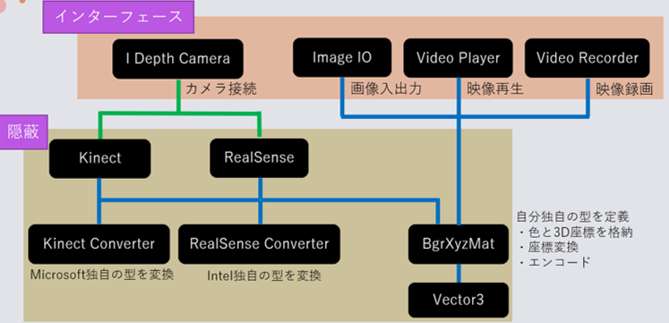

# Yamashita.DepthCamera

Kinect, Realsenseが同一のインターフェースで動きます。  
使い方はIDepthCamera.csのとおり, ConnectとDisconnectだけ。  
  
  
  
ここでは出力のBgrXyzMatクラスについて説明します。  
ざっとその機能を列挙すると、  
  
* BGR ... カラー画像
* XYZ ... 実空間座標 (mm)
* BgrXyzMat ( Mat bgr, Mat xyz ) ... コンストラクタ
* BgrXyzMat ( byte[] BGRBytes, byte[] XYZBytes ) ... コンストラクタ
* Create ( Mat bgr, Mat xyz ) ... メソッドで初期化
* YmsDecode ( byte[] BGRBytes, byte[] XYZBytes ) ... メソッドで初期化
* YmsEncode () ... byte配列にエンコード
* Empty () ... 中身の存在を確認
* Depth8 ( int minDistance, int maxDistance ) ... XYZを8bitグレースケールに圧縮
* GetPointInfo ( Point point ) ... 指定したピクセルの情報を構造体で返す
* Move ( Vector3 delta ) ... 指定したベクトル分だけ全体を移動させる
* Scale ( Vector3 delta ) ... 指定したベクトル分だけ全体のスケールを変える
* Rotate ( float pitch, float yaw, float roll ) ... 右手系の3次元回転  
  
そしてこれらをメソッドチェーン的に繋げることで点群の扱いを簡便にしました。  
例)  
```
// 初期化と回転の補正をまとめて記述
var frame = BgrXyzMat
        .Create( colorMat, pointCloudMat )
        .Rotate( 0.1f, 0f, -0.2f );
```
```
// 初期化と並進＆回転してからの距離の取得を一発で
var distance = BgrXyzMat
        .Create ( colorMat, pointCloudMat )
        .Move ( new Vector3 ( 0, 0, 1000 ) )
        .Rotate ( -0.5f, 0f, 0f ) )
        .GetPointInfo ( new Point ( 100, 150 ) )
        .Z;
```
