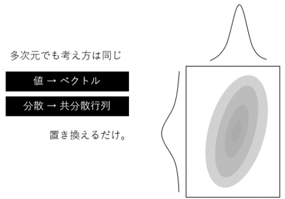

# Yamashita.Control

## カルマンフィルタとパーティクルフィルタ
どちらも統計学的な原理を利用した状態推定のアルゴリズムです。   
数学的な理解はなんとなくでも利用すれば特性は掴めてくるはず。特に大切なのは分散の解釈で，以下のように分散の大小がそのデータの信頼度を表現します。  
  
  
  
内部的に保持しているシステムの状態と外部からの観測値のバランスを，それぞれの不確かさ(分散)から導き出します。  
カルマンフィルタは時刻t-1での情報から推定した値と時刻tで得られた観測値から時刻tでの状態の修正値と時刻t+1での推定値を算出します。  
計算の都合上，線形な状態遷移モデルでノイズは正規分布にしたがうことになっています。イメージは以下のとおり。  
  
  
  
1次元情報だとお馴染みの正規分布曲線ですが2次元なら分布は楕円で表現できます。  
計算は行列でおこなうので理論上(想像力の限界があるよね)いくらでも次元は拡張できます。  
  
  
  
細かい理屈が要り様でしたら書籍やネット記事などを漁ってみてください。  
参考記事貼っときます。↓↓  
* [【カルマンフィルタってなに？】](https://qiita.com/IshitaTakeshi/items/740ac7e9b549eee4cc04)
* [【シンプルなモデルとイラストでカルマンフィルタを直観的に理解してみる】](https://qiita.com/MoriKen/items/0c80ef75749977767b43)  
  
一方で，パーティクルフィルタはよく似た理論を違うアプローチで解いたものです。  
カルマンフィルタでは連続的な分布で表現していたところを，乱数で生成した粒子で表します。  
  
  
  
考え方はとてもシンプルです。粒子の生成のバラツキ具合を観測値と辻褄が合うように逐次調整していく，と考えていただいたらよいかと思います。  
プログラムの実装も割と単純ですが，繰り返し計算に頼ってしまうぶんカルマンフィルタに比べて計算量が多いという欠点があります。  
  
  
  
参考記事↓↓  
* [【パーティクル・フィルタをやさしく解説】](http://www.allisone.co.jp/html/Notes/DSP/Filter/particle-filter/index.html)
* [【Pythonによるパーティクルフィルタの実装と状態空間モデルへの適用】](https://qiita.com/kenmatsu4/items/c5232b1499dfd00e877d)
